# ContextDrop Architecture Diagrams

Visual representations of the ContextDrop system architecture using Mermaid diagrams.

---

## 1. System Overview

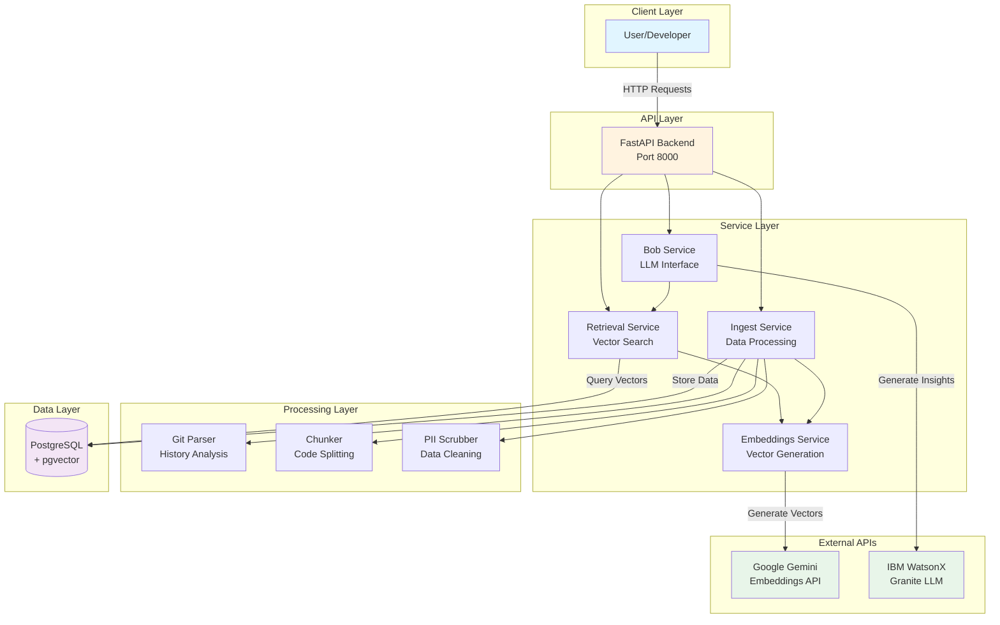

---

## 2. Data Flow: Repository Ingestion

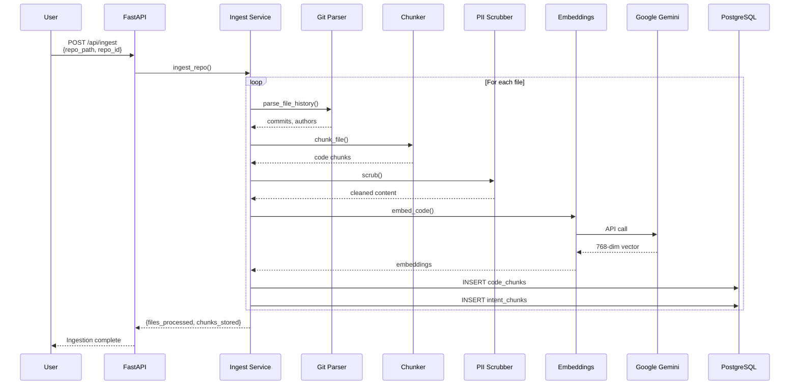

---

## 3. Data Flow: Capsule Generation

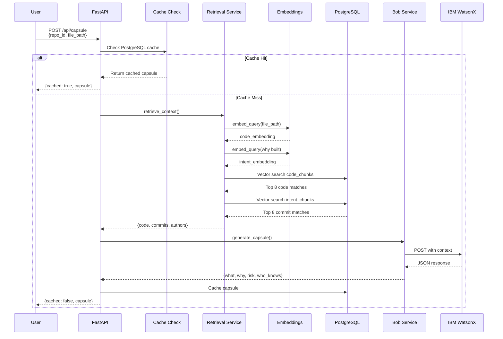

---

## 4. Component Architecture

```mermaid
graph LR
    subgraph "Backend Application"
        subgraph "API Routes"
            R1[/api/capsule]
            R2[/api/ticket]
            R3[/api/pr-brief]
            R4[/api/bus-factor]
            R5[/api/departure-brief]
            R6[/api/ingest]
        end
        
        subgraph "Services"
            S1[bob.py]
            S2[embeddings.py]
            S3[retrieval.py]
            S4[ingest.py]
        end
        
        subgraph "Ingestion"
            I1[git_parser.py]
            I2[chunker.py]
            I3[pii.py]
        end
        
        subgraph "Core"
            C1[database.py]
            C2[config.py]
        end
    end
    
    R1 --> S3
    R1 --> S1
    R2 --> S3
    R2 --> S1
    R3 --> S3
    R3 --> S1
    R4 --> I1
    R5 --> I1
    R5 --> S1
    R6 --> S4
    
    S1 --> C2
    S2 --> C2
    S3 --> S2
    S3 --> C1
    S4 --> I1
    S4 --> I2
    S4 --> I3
    S4 --> S2
    S4 --> C1
    
    C1 --> C2
    
    style R1 fill:#bbdefb
    style R2 fill:#bbdefb
    style R3 fill:#bbdefb
    style R4 fill:#bbdefb
    style R5 fill:#bbdefb
    style R6 fill:#bbdefb
    style S1 fill:#c8e6c9
    style S2 fill:#c8e6c9
    style S3 fill:#c8e6c9
    style S4 fill:#c8e6c9
```

---

## 5. Database Schema

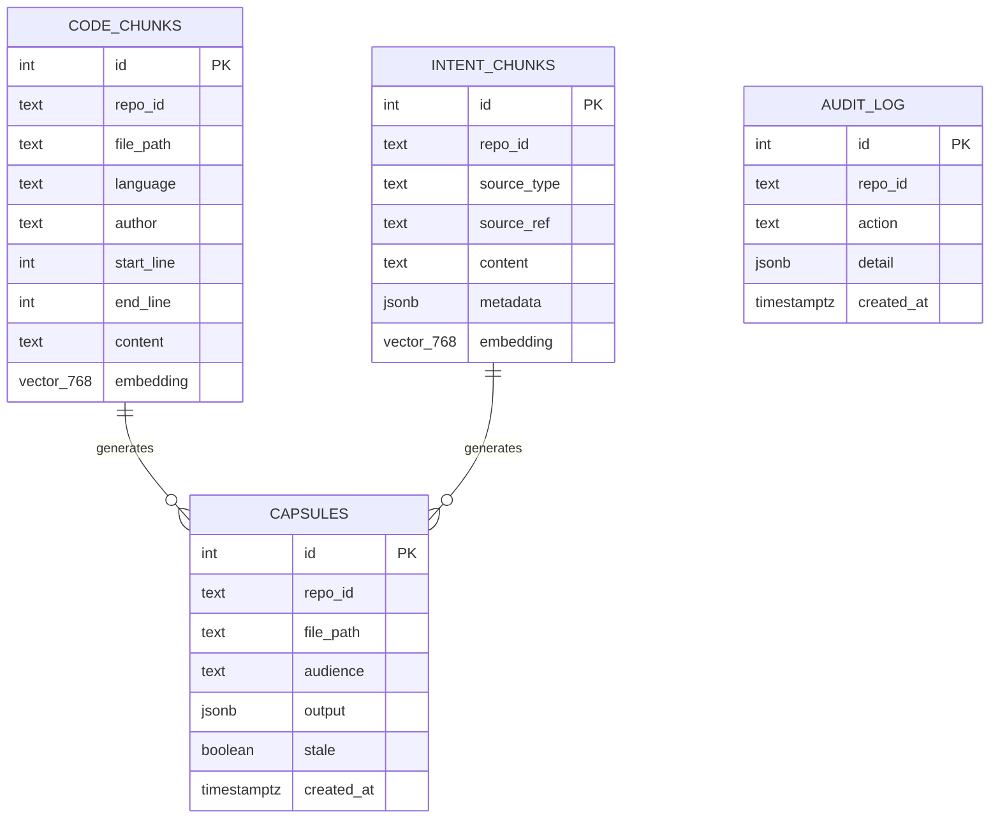

---

## 6. Vector Search Flow

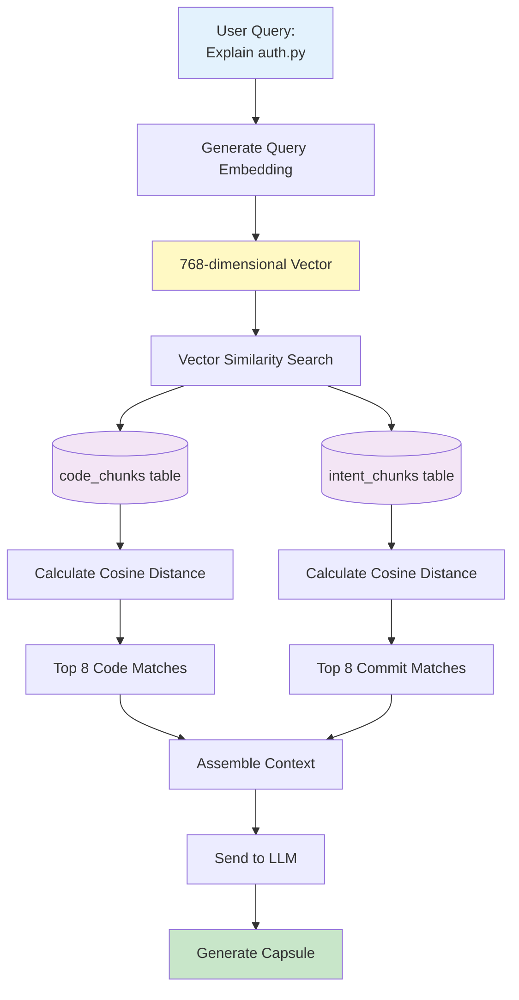

---

## 7. Deployment Architecture

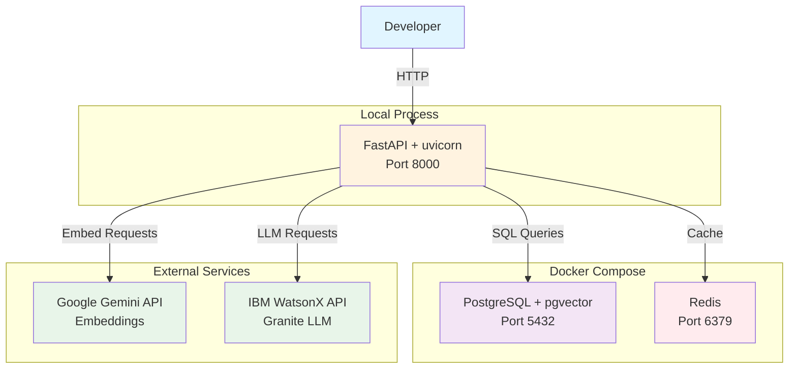

---

## 8. Request Flow: Ticket Intelligence

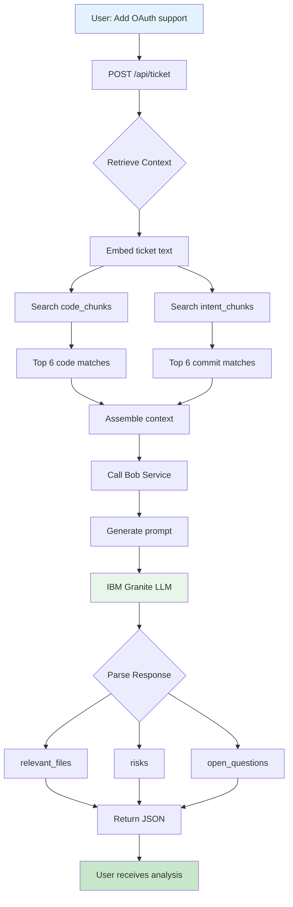

---

## 9. Bus Factor Analysis Flow

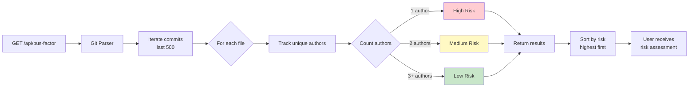

---

## 10. Embedding Generation Process

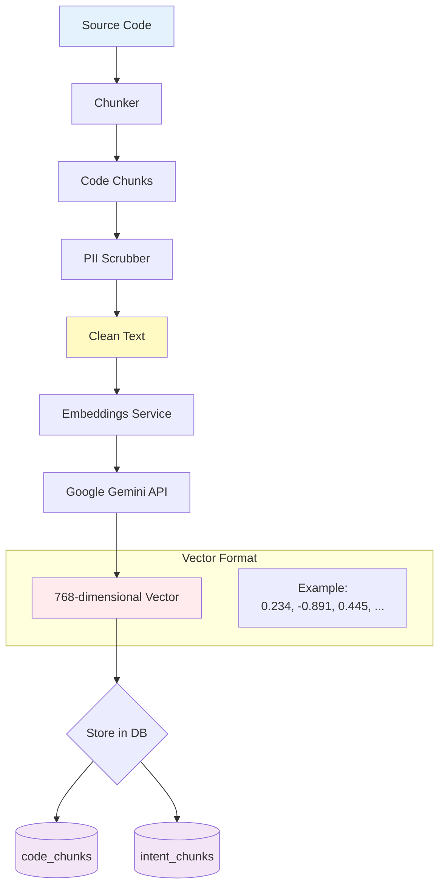

---

## 11. Audience-Specific Output Flow

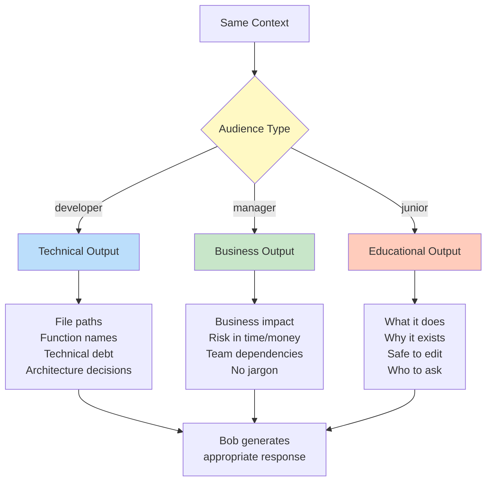

---

## 12. Error Handling Flow

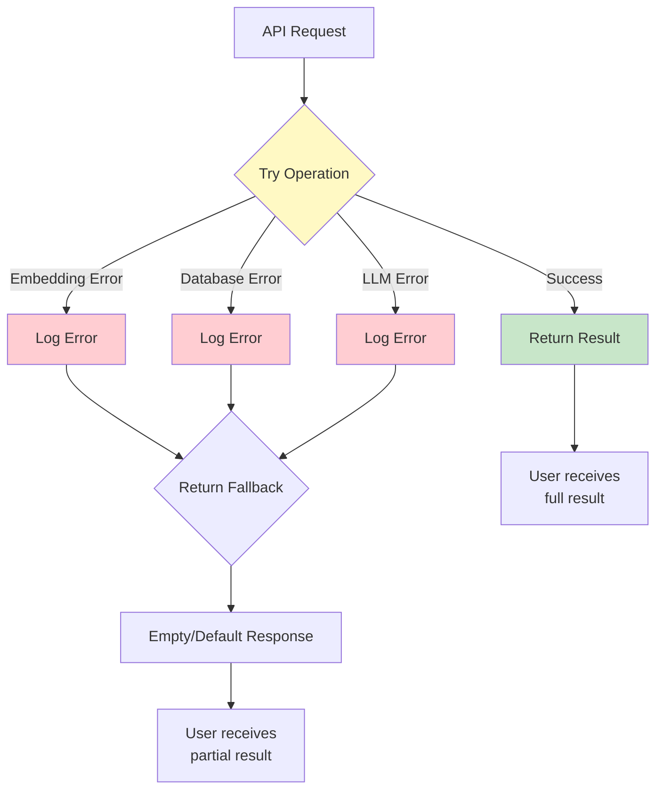

---

## 13. Caching Strategy

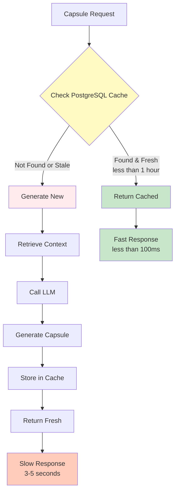

---

## 14. File Processing Pipeline

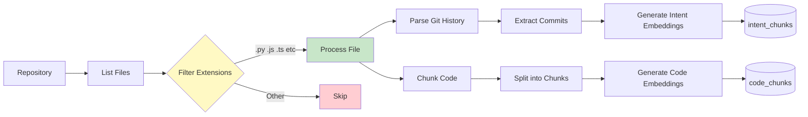

---

## 15. Complete System Integration

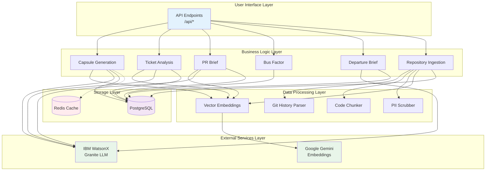

---

## How to View These Diagrams

### In GitHub/GitLab
These Mermaid diagrams will render automatically when viewing this file on GitHub or GitLab.

### In VS Code
Install the "Markdown Preview Mermaid Support" extension:
```bash
code --install-extension bierner.markdown-mermaid
```

### Online Viewer
Copy any diagram to: https://mermaid.live/

### Export as Images
Use the Mermaid CLI:
```bash
npm install -g @mermaid-js/mermaid-cli
mmdc -i ARCHITECTURE_DIAGRAMS.md -o diagrams/
```

---

## Diagram Legend

| Color | Meaning |
|-------|---------|
| 🔵 Blue | User-facing components |
| 🟢 Green | Processing/Logic components |
| 🟣 Purple | Data storage |
| 🟡 Yellow | Decision points |
| 🔴 Red | Error states |
| 🟠 Orange | External services |

---

## Additional Resources

- **System Architecture**: See `SYSTEM_ARCHITECTURE.md` for detailed explanations
- **Deployment Guide**: See `DEPLOYMENT_GUIDE.md` for setup instructions
- **Architecture Review**: See `ARCHITECTURE_REVIEW.md` for issues and fixes